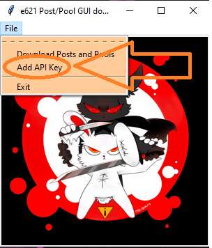
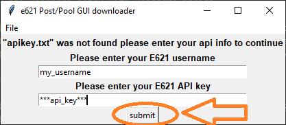
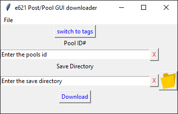
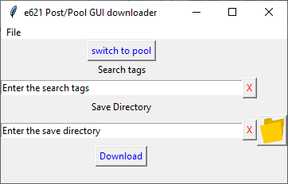

# Smoke Loader - E621 Posts and pool downloader #

## About ##

-----------

SmokeLoader is made to be tool to easly get posts and pools from e621.net

## Dependencies ##

-----------

To use Smokeloader the following is needed:

- Python 3
  - Download Python 3 if needed from: https://www.python.org/downloads/

## Setup ##

-----------

After Python 3 is installed. Pull the repository or SmokeLoader to the desired folder.

Install the python request library if is not already installed.

Via:

```pip install requests```

Then to run the SmokeLoader

Run:

```python3 smokeloader_gui_downloader.py```

On running the smokeloader_gui_downloader code you will be greeted by the splash/ index page.


To use the smokeloader_gui_downloader program to download posts and pools. You will need to add your e621 account username and api key.

Click on the 'File' button on the menu bar and select 'Add API Key'



Select Add 'API Key'

Enter your e621 `API Key` and click submit.



And you are ready to start downloading!

## Usage ##

-----------

### Pool Downloading ###



To download a pool, get the pools id from e621.net

Enter the `pool id` into the `Enter the pool id` line. 

Enter the location to save the to the download line

-----------

### Post Downloading ###



Enter the `pool id` into the `pool id` line

Enter the location to save the files to the download line

Press Download to start
